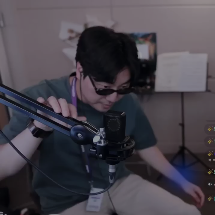
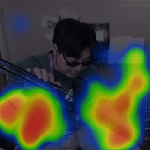
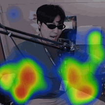

<div align="center" style="text-align: center">

# **OpenPose Detect Hands with Heatmap**

<p style="text-align: center">
  
  
  
</p>

</div>

> Source from [요룰레히 9_21- HEYYEYAAEYAAAEYAEYAA (What's Up)](https://www.youtube.com/watch?v=u6w9HYmQMgQ)

This is a simply application for using OpenPose model for detecting hands and showing the heatmap.

## Model

You can get the pre-trained model from Hugging Face.

Download it into `./model`.

https://huggingface.co/NatLee/openpose-keras-model

```bash
git clone --depth=1 git@hf.co:NatLee/openpose-keras-model ./model/
```

```
model
└── weights.h5
```

## Usage

> Tested on x86/64 CPU, Intel 12th-i5 with 16 GB RAM.

1. Prepare the model from [#Model](#model).

2. Prepare your video in `./data` named `test.mp4`.
    The directory will like below:

    ```
    .
    ├── data
    │   ├── README.md
    │   └── test.mp4 <--- Your video
    ├── doc
    │   ├── heatmap-motion.gif
    │   ├── heatmap.png
    │   └── original-frame.png
    ├── docker-compose.yml
    ├── Dockerfile
    ├── LICENSE
    ├── model
    │   └── weights.h5 <--- The model
    ├── README.md
    ├── requirements.txt
    └── src
        ├── convert-png-to-gif.py
        ├── docker-entrypoint.sh
        ├── main.py
        ├── openpose
        │   ├── __init__.py
        │   ├── model.py
        │   ├── OpenposeModel.py
        │   ├── prediction.py
        │   └── util.py
        └── utils
            ├── draw_heat.py
            ├── FPS.py
            ├── heatmapper
            │   ├── assets
            │   │   ├── 450pxdot.png
            │   │   ├── default.png
            │   │   └── reveal.png
            │   ├── heatmapper.py
            │   └── __init__.py
            ├── __init__.py
            └── ROIs.py

    8 directories, 28 files
    ```

3. Just run docker command with the following:

    ```bash
    docker-compose build && docker-compose up
    ```

    The result will be generated in the folder `./tmp`.

## Contributor

<!-- ALL-CONTRIBUTORS-LIST:START - Do not remove or modify this section -->
<!-- prettier-ignore-start -->
<!-- markdownlint-disable -->
<table>
  <tbody>
    <tr>
      <td align="center"><a href="https://github.com/NatLee"><br /><sub><b>Nat Lee</b></sub></a></td>
    </tr>
  </tbody>
</table>

<!-- markdownlint-restore -->
<!-- prettier-ignore-end -->

<!-- ALL-CONTRIBUTORS-LIST:END -->

## Reference

- Heatmap package is from [HeatMappy](https://github.com/LumenResearch/heatmappy/tree/master/heatmappy).
- The version of keras with Open Pose model is from [Open-Pose-Keras](https://github.com/cchamber/Open-Pose-Keras).

## LICENSE

[AFLv3](LICENSE)
